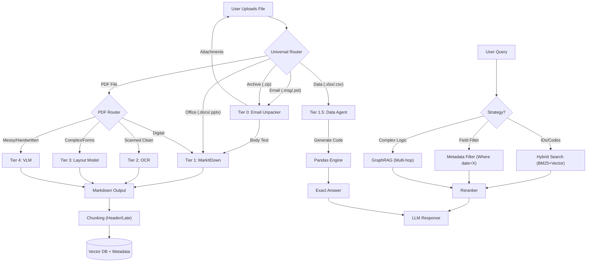

# Intelligent Document Processing (IDP): The "Universal" Fail-Up Architecture

**Version:** 2025.3 (Universal Format + Advanced RAG)
**Philosophy:** "Unpack first, then Route." Treat every file as a container until proven otherwise. Start simple, fail up to complex AI.

## 🛠️ Tech Stack & Dependencies

  * **Ingestion (Tier 0):** `extract-msg` (.msg), `libratom` (.pst), `markitdown` (Office/Zip/HTML)
  * **Extraction (Tier 1):** `pymupdf4llm` (PDF), `MarkItDown` (Word/PPT)
  * **Data Agent (Tier 1.5):** `pandasai` or `llama-index-experimental` (Pandas Query Engine)
  * **Vision/OCR (Tier 2-4):** `Qwen2.5-VL` (Open Source), `Claude 3.5 Sonnet` (Cloud)
  * **Vector DB:** `Qdrant`, `Weaviate`, or `pgvector`
  * **Orchestration:** Python 3.10+

-----

## 📋 The Tier List Strategy (Extraction)

The system processes documents using a "Waterfall" approach.

### Tier 0: The "Ingestion Layer" (Unpackers)

  * **Best For:** "Container" files like Emails (`.msg`, `.pst`, `.eml`) and Archives (`.zip`).
  * **Logic:** You cannot "read" a container; you must explode it.
  * **Tools:**
      * `.msg`: **`extract-msg`** (Extracts body + saves attachments to disk).
      * `.pst`: **`libratom`** (Converts PST messages to individual `.eml` files).
      * `.zip`: **`zipfile`** (Recursive extraction).
  * **Action:** Extract the *Body Text* (send to Tier 1) and *Attachments* (send back to **Start** recursively).

### Tier 1: The "Universal Converter" (Native Digital)

  * **Best For:** Digital Documents (Word, PowerPoint, HTML, Digital PDFs).
  * **Primary Tool:** **`MarkItDown`** (Microsoft).
      * *Why?* It converts `.docx`, `.pptx`, `.html`, and `.xml` into perfect, clean **Markdown**.
  * **PDF Tool:** **`pymupdf4llm`** (Superior for PDF-specific layout preservation).
  * **Cost:** Free.

### Tier 1.5: The "Data Agent" (Code Interpreter)

  * **Best For:** Excel (`.xlsx`), CSV, Parquet.
  * **Problem:** Chunking a spreadsheet destroys row/column logic. RAG cannot answer "Sum of Column C."
  * **Solution:** Do not "read" the text. Load it into a DataFrame and let an LLM write code to query it.
  * **Primary Tool:** **`PandasAI`** (with Docker Sandbox) or `LlamaIndex PandasQueryEngine`.
  * **Action:** User asks "Total spend in Jan?" $\rightarrow$ LLM generates `df[df['month']=='Jan']['spend'].sum()` $\rightarrow$ Returns exact answer.

### Tier 2: The "Standard OCR" (Offline Baseline)

  * **Best For:** Clean scans (300 DPI+) inside PDFs or Images.
  * **Tool:** `OCRmyPDF` or `PaddleOCR` (Better for non-English).

### Tier 3: The "Layout-Aware" Approach (Forms)

  * **Best For:** Invoices, Tax Forms, Complex Layouts.
  * **Tools:** `Mistral-OCR` (API) or `Surya` (Open Source).

### Tier 4: The "VLM" Approach (The Nuclear Option)

  * **Best For:** Handwriting, blurry photos, "Reasoning" (e.g., "Why is this rejected?").
  * **Tools:** `Qwen2.5-VL` (Self-hosted SOTA) or `Claude 3.5 Sonnet`.

-----

## 🧠 The "Universal Router" Logic

This Python script acts as the traffic controller. It handles file types *before* checking image quality.

```python
import os
import fitz  # pymupdf
import cv2
import numpy as np
from markitdown import MarkItDown

def universal_router(file_path):
    ext = os.path.splitext(file_path)[1].lower()
    
    # --- LEVEL 0: CONTAINERS ---
    if ext in ['.zip', '.tar', '.7z']:
        return "Tier 0: Explode Archive"
    
    if ext in ['.msg', '.eml', '.pst']:
        return "Tier 0: Email Extractor (Body -> Tier 1, Attachments -> Recurse)"

    # --- LEVEL 1.5: STRUCTURED DATA ---
    if ext in ['.csv', '.xlsx', '.xls', '.parquet']:
        return "Tier 1.5: Data Agent (PandasAI)"

    # --- LEVEL 1: NATIVE OFFICE DOCS ---
    if ext in ['.docx', '.pptx', '.html', '.xml']:
        # Quick check: is it empty/image-only?
        md = MarkItDown().convert(file_path).text_content
        if len(md.strip()) < 50: 
            return "Tier 4: VLM (Likely a scanned image inside Word)"
        return "Tier 1: MarkItDown"

    # --- LEVEL 2/3/4: PDF & IMAGES ---
    if ext == '.pdf':
        return smart_route_pdf(file_path) # The original PDF logic
    
    if ext in ['.jpg', '.png', '.jpeg', '.tiff']:
        return "Tier 2/4: Image OCR Logic"

    return "Unknown Format"

def smart_route_pdf(pdf_path):
    """Decides between Digital, OCR, or VLM for PDFs"""
    doc = fitz.open(pdf_path)
    page = doc[0]
    
    # 1. Text Density Check (Digital Native)
    text_area = sum([fitz.Rect(b[:4]).get_area() for b in page.get_text("blocks")])
    page_area = page.rect.get_area()
    
    if (text_area / page_area) > 0.8:
        return "Tier 1: pymupdf4llm"

    # 2. Render & Check Quality (Blur/Noise)
    pix = page.get_pixmap(dpi=72)
    img = np.frombuffer(pix.samples, dtype=np.uint8).reshape(pix.h, pix.w, pix.n)
    if pix.n == 4: img = cv2.cvtColor(img, cv2.COLOR_RGBA2GRAY)
    else: img = cv2.cvtColor(img, cv2.COLOR_RGB2GRAY)

    blur_score = cv2.Laplacian(img, cv2.CV_64F).var()
    if blur_score < 100:
        return "Tier 4: VLM (Image is blurry/Handwritten)"
        
    # 3. Default to Standard OCR
    return "Tier 2: Standard OCR"
```

-----

## 💬 Path 2: The Chat Path (Advanced Retrieval)

This section details the "Fail Up" strategy for *retrieving* answers once the text is extracted.

### Step A: Intelligent Chunking

  * **Method:** **Markdown Header Splitting** (LangChain) or **Late Chunking** (Jina AI).
  * **Why:** Respects the document structure (headers/paragraphs) instead of arbitrary character counts.

### Step B: The Retrieval Strategy (Levels of Complexity)

**Level 1: Hybrid Search (The Baseline)**

  * **Mechanism:** `Vector Search` (Semantic) + `BM25` (Keyword).
  * **Best For:** Exact matches (IDs, Codes) and general topic search.
  * **Example:** "Find Invoice \#9921." (Vector fails, BM25 succeeds).

**Level 2: Metadata Filtering (The "Sweet Spot")**

  * **Mechanism:** "Self-Querying" Retrieval.
  * **Integration:** Structured fields from Path 1 (Date, Vendor, Total) are saved as **metadata tags** on vector chunks.
  * **Best For:** **Relationships across fields** within a document.
  * **Example:** "Show me invoices from *Acme* over *$500*."
      * *System Action:* `WHERE vendor="Acme" AND total > 500` (Hard Filter) $\rightarrow$ Vector Search remaining chunks.
  * **Verdict:** **Recommended Default.** Solves 95% of cases without GraphRAG.

**Level 3: GraphRAG (The "Nuclear Option")**

  * **Mechanism:** Knowledge Graph + LLM Graph Traversal.
  * **Best For:** **Multi-hop reasoning** across *different* files.
  * **When to use:** Only if users ask questions connecting disjointed entities.
  * **Example:** "Who is the *manager* of the project that generated the *highest cost* invoice?" (Connects `Org Chart` $\rightarrow$ `Project` $\rightarrow$ `Invoice`).

### Step C: Reranking (The Quality Filter)

  * **Action:** Pass top 20 results to `bge-reranker-v2-m3`.
  * **Why:** Sorts results by true relevance before sending to the LLM.

-----

## 📊 The Master Architecture Flowchart


