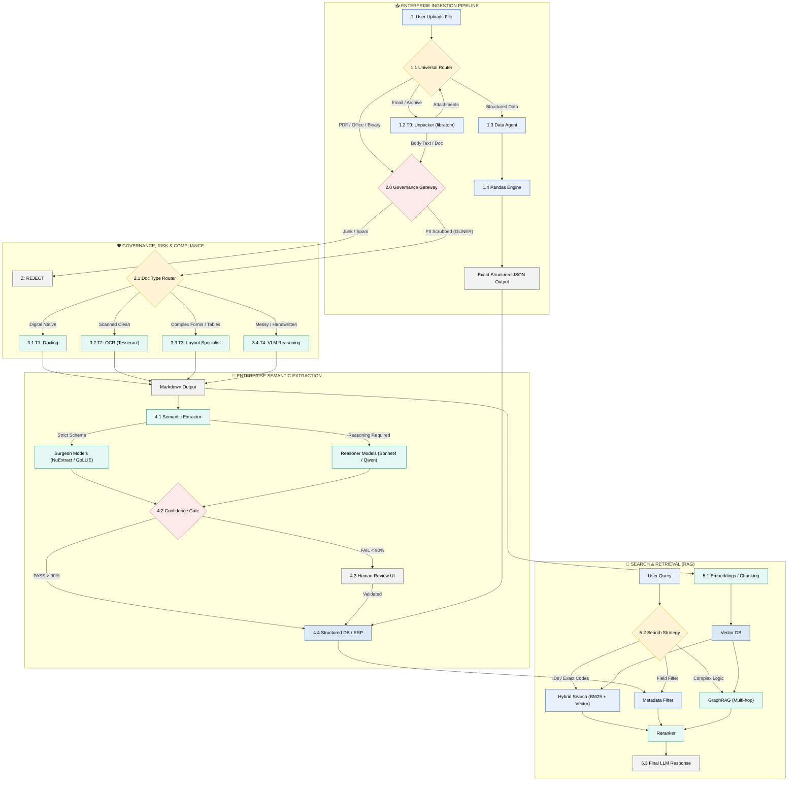

Here is the fully consolidated, production-ready **TITAN-IDP 2.0 (The "Redemption" Architecture)**.

This version incorporates the **Governance Layer** (to fix the legal risks), the **Cost-Routing Logic** (to fix the bankruptcy risks), and the **Tiered Model Strategy** (to fix the operational naivety), formatted exactly as requested.

***

# 🏛️ TITAN-IDP 2.0: Enterprise Document Intelligence Engine
**Mission:** Ingest any file, **secure it**, route it intelligently, and extract precise data with **zero-trust validation**.

---

### 🔷 PHASE 1: INGESTION & SANITIZATION (The "Shield")
**Goal:** Receive files, unpack them, and **scrub sensitive data** before expensive AI touches them.

#### TIER 0: THE UNPACKER (Recursive Utilities)
* **What it is:** Recursive script for zips, emails (.msg/.eml), and tarballs.
* **Tools:** `libratom`, `unstructured`.
* **Why it matters:** 40% of data is hidden in attachments.
* **What fails if missing:** The system treats a zip file as binary garbage.

#### 🛑 TIER 0.5: THE GOVERNANCE GATEWAY (The "Legal Saver") 🆕
* **What it is:** A local CPU-based filter that scans for PII and "Junk" before processing.
* **Tools:**
    * **The Spotter:** `GLiNER` or `Microsoft Presidio` (Local CPU).
    * **The Accountant:** `FastText` classifier.
* **Action:**
    1.  **PII Check:** If SSN/Credit Card detected → Redact or Tag "High Sensitivity".
    2.  **Junk Check:** If file = "Spam" or "Blank" → Reject immediately.
* **Why it matters:** Prevents sending customer PII to public LLMs (GDPR/SOC2 compliance) and stops you from paying $0.05 to process a blank page.
* **What fails if missing:** You violate privacy laws and go bankrupt processing spam.

---

### 🔷 PHASE 2: THE ROUTING CORE (The "Traffic Controller")
**Goal:** Send the document to the **cheapest possible model** that can solve the problem.

#### THE ROUTER LOGIC
* **Rule 1 (Digital Native):** If PDF has embedded text layer → **Go to Tier 1**.
* **Rule 2 (Clean Scan):** If standard font & simple layout → **Go to Tier 2**.
* **Rule 3 (Complex Layout):** If tables, forms, or mixed columns → **Go to Tier 3**.
* **Rule 4 (Messy/Handwriting):** If unreadable, handwritten, or requires reasoning → **Go to Tier 4**.

---

### 🔷 PHASE 3: THE PROCESSING CORE (Layout & Text Recovery)
**Goal:** Convert visual pixels into structured Markdown.

#### TIER 1: DIGITAL NATIVE (The "Truth" Layer)
* **Target:** Born-digital PDFs, Word, Excel, HTML.
* **Model:** `Docling` (IBM) or `MarkItDown` (Microsoft).
* **Why it matters:** Deterministic. It reads the internal code. **Zero Hallucination Risk.**
* **Cost:** Near Zero (CPU only).

#### TIER 2: STANDARD OCR (The "Commodity" Layer)
* **Target:** Clean scans, simple letters.
* **Model:** `Tesseract 5` or `Mistral Nemo 12B` (for light correction).
* **Why it matters:** Handles 60% of business docs cheaply.
* **Cost:** Very Low.

#### TIER 3: THE SPECIALIST (The "Layout" Layer) 🆕
* **Target:** Complex Invoices, Tables, Bank Statements.
* **Model:** `Numarkdown-8b`.
* **Why it matters:** This model specializes in converting visual grids into Markdown tables without breaking the structure. It replaces generic OCR for complex formatting.
* **What fails if missing:** Tables are read as flat text, destroying row/column relationships.

#### TIER 4: THE NUCLEAR OPTION (The "Reasoning" Layer)
* **Target:** Handwriting, Crossed-out text, "Spatial" reasoning.
* **Model:** `Claude Sonnet 4` (Visual King) or `GPT-4o`.
* **Why it matters:** Can read "between the lines" (e.g., a handwritten note in the margin).
* **Cost:** High (Use sparingly).

---

### 🔷 PHASE 4: THE SEMANTIC LAYER (Extraction to JSON)
**Goal:** Turn Markdown into validated JSON Data using the **"Surgeon vs. Reasoner"** strategy.

#### LAYER A: THE SURGEONS (Strict Schema) 🆕
* **Target:** Standard Forms (Invoices, POs) where fields are known.
* **Models:** `NuExtract 1.5` (Standard) or `GoLLIE` (Python-heavy).
* **Why it matters:** These are fine-tuned to **force** text into a schema. They hallucinate less than Chat models because they are trained for "Pure Extraction."

#### LAYER B: THE REASONING BACKUP (Complex/Messy)
* **Target:** Legal contracts, long unstructured paragraphs.
* **Models:** `Claude Sonnet 4` (Cloud) or `Qwen 2.5` (Local/Private).
* **Action:** Invoked only if `NuExtract` fails or returns low confidence.
* **Why it matters:** Handles nuance that strict extractors miss.

#### LAYER C: THE CONFIDENCE GATE (The "Safety Net") 🆕
* **Tool:** `DSPy` assertions + Logic Scripts.
* **Action:**
    * Check: `Total` == `Sum(Line Items)`?
    * Check: `Confidence Score` > 90%?
* **Result:**
    * **Pass:** Send to Database/ERP.
    * **Fail:** **Route to Human-in-the-Loop UI (Label Studio).**
* **What fails if missing:** Bad data pollutes your downstream systems silently.

---

### 🔷 PHASE 5: THE CHAT & RETRIEVAL ENGINE (RAG)
**Goal:** Chat with the data *after* it has been cleaned and structured.

#### STEP 1: LATE CHUNKING
* **Model:** `Jina AI Embeddings v3`.
* **Why it matters:** Preserves context by encoding the whole page before cutting it up.

#### STEP 2: HYBRID SEARCH
* **Database:** `Qdrant` or `Weaviate`.
* **Strategy:** Vector (Concepts) + Keyword (BM25 for exact ID matches).

#### STEP 3: GRAPHRAG (Knowledge Graph)
* **Why it matters:** Links entities across documents (e.g., Vendor X -> Invoice A -> Contract B).

Flowchart :

